<div align="center">

# Assalamualaikum, I'm Md. Manam Khan 👋

### Competitive Programmer → Software Developer




</div>

---

### 🧭 About Me

I'm a CSE undergraduate who genuinely enjoys **competitive programming, problem solving, teaching, leading, and building software**. Right now I'm strengthening my foundations in **C++ and Data Structures & Algorithms** while expanding into **Web Development and Backend Engineering**.

I like turning ideas into working projects, learning through implementation rather than just theory, and treating every bug as a small lesson rather than a setback.

📧 **Reach me at:** [manamkhan921@gmail.com](mailto:manamkhan921@gmail.com)

---

### 🚀 What I'm Up To

```yaml
Currently Building:  CakeCraft — an interactive cake-building website
Currently Learning:  Web Development
Currently Focused:   Competitive Programming & Software Development
Curious About:       Algorithms, Backend Engineering & Databases
```

---

### 🌐 Let's Connect

<p align="left">
  <a href="https://discord.gg/pvb8z7PFva">
    
  </a>
  <a href="https://facebook.com/Manam.the.Wildfire">
    
  </a>
  <a href="https://instagram.com/manam_the_wildfire">
    
  </a>
</p>

---

### 🛠️ Tech Stack

**Languages**

<p align="left">
  
  
  
  
  
  
</p>

**Web & Database**

<p align="left">
  
  
  
</p>

**Tools**

<p align="left">
  
  
  
</p>

---

## 📊 GitHub Stats


---

## 🏆 GitHub Trophies


---

## 📈 Top Contributed Repositories


---

<div align="center">

*"Solve problems. Build things. Keep improving."*


<sub>Crafted with care — powered by <a href="https://gprm.itsvg.in">GPRM</a></sub>

</div>
